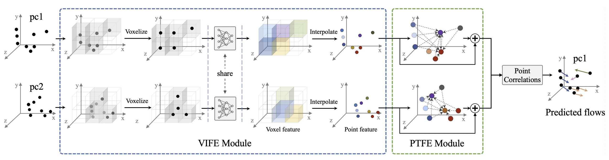

# SCTN

## About



[SCTN](https://arxiv.org/abs/2105.04447) (**S**parse **C**onvolution-**T**ransformer **N**etwork for Scene Flow 
Estimation) is one network architecture used for predicting scene flows between two consecutive frames of point 
cloud. This repository contains the PyTorch implementation for it.

## Installation

```
conda create -n sctn python=3.6  # The code is tested on 3.6.13. Other versions my also work 
conda activate sctn

# load modules.
module load gcc/8.2.0     # Just make sure gcc version is right. Other versions may also work
module load cuda/10.2.89  # make sure the version is compatible with pytorch

# pytorch
conda install pytorch torchvision cudatoolkit=10.2 -c pytorch

# minkowski engine
conda install openblas-devel -c anaconda
pip install -U git+https://github.com/NVIDIA/MinkowskiEngine -v --no-deps --install-option="--blas_include_dirs=${CONDA_PREFIX}/include" --install-option="--blas=openblas"

# others
conda install -c conda-forge tqdm
pip install tensorboard
```

## Data preparation

Please follow the instructions given in [HPLFlowNet](https://github.com/laoreja/HPLFlowNet) to construct the 
FlyingThings3D and KITTI datasets. Finally the directory structure should like this:

```
sctn
├── data
│   └── HPLFlowNet
│       ├── FlyingThings3D_subset_processed_35m
│       └── KITTI_processed_occ_final
├── datasets
├── imgs
├── models
├── pre-trained
├── README.md
├── train.py
└── val_test.py
```

## Testing

One model trained on FT3D using 8192 points is provided in `pre-trained/model-59.tar`.

* To evaluate one pretrained model on the test set of FT3D:
  ```
  python val_test.py --dataset HPLFlowNet_FT3D --nb_points 8192 --path2ckpt pre-trained/model-59.tar
  ```

* To evaluate one pretrained model on KITTI dataset:
  ```
  python val_test.py --dataset HPLFlowNet_kitti --nb_points 8192 --path2ckpt pre-trained/model-59.tar
  ```

## Training

By default, one `experiments` directory will be created automatically. The tensorboard's logs and the checkpoints
will be saved in this directory.

* To train SCTN on FT3D using 8192 points:
  ```
  python train.py --nb_iter 1 --dataset HPLFlowNet --nb_points 8192 --batch_size 4 --nb_epochs 60
  ```

## Acknowledgments
The implementation is based on:
* [FLOT](https://github.com/valeoai/FLOT) 
* [HPLFlowNet](https://github.com/laoreja/HPLFlowNet)
* [Weakly Supervised Learning of Rigid 3D Scene Flow](https://github.com/zgojcic/Rigid3DSceneFlow)
* [Pytorch Implementation of Various Point Transformers](https://github.com/qq456cvb/Point-Transformers)


## Citation
If you use this code for your research, please cite our paper.
```
@inproceedings{Li:2022:sctn, 
  title={SCTN: Sparse Convolution-Transformer Network for Scene Flow Estimation},
  author={Bing Li and Cheng Zheng and Silvio Giancola and Bernard Ghanem},
  booktitle = {AAAI}, 
  year = {2022}
}
```